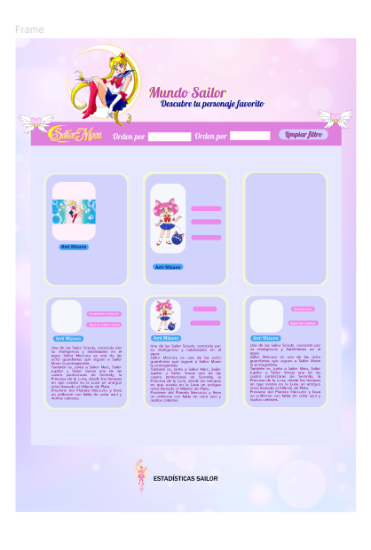

Mundo Sailor
Descripción del Proyecto
"Mundo Sailor" es un proyecto web dedicado a los fanáticos de Sailor Moon, ofreciendo una experiencia visual y funcional que celebra este icónico anime. El sitio incluye varias secciones, tales como un encabezado con logo, un título, un menú, cartas con información útil de los 24 personajes principales del manga y una sección de estadísticas llamada "Estadísticas Sailor".
Proceso de Diseño
1. Investigación y Planificación
El primer paso fue investigar el universo de Sailor Moon para capturar la esencia y estética del anime. Esto incluyó estudiar los colores, símbolos y la estructura narrativa para reflejar fielmente en el diseño del sitio web, entregándole un diseño mas vintage en relación al manga y la época en la que se creó.
2. Boceto y Estructura
Se crearon bocetos iniciales del diseño de la página web, enfocándose en la disposición del logo, el encabezado, el título, el menú y también se realizó un diseño aparte del modelo de carta. Estos elementos se organizaron para asegurar una navegación intuitiva y una presentación visualmente atractiva.
3. Desarrollo del Encabezado
El encabezado fue desarrollado para incluir una imagen de la protagonista de Sailor Moon, quisimos mostrar solo este personaje en vez de las demás, ya que podría ser muy redundante, un título central y un menú cercano para facilitar la navegación. Utilicé HTML y CSS para asegurar que todos estos elementos se alinearan correctamente y fueran responsivos en diferentes dispositivos.
4. Sección de Estadísticas
La sección "Estadísticas Sailor" fue diseñada para mostrar información relevante sobre los personajes y sus atributos, estos se actualizan con cada filtro para que así sea más dinámico. Se incorporó una imagen de la varita mágica de Sailor Moon junto al título "Estadísticas Sailor" para añadir un toque visual que resuena con los fans.
5. Implementación y Pruebas
Se realizaron múltiples iteraciones y pruebas para asegurar que el diseño cumpliera con los estándares de usabilidad y accesibilidad. Cada sección fue ajustada en base a retroalimentación para mejorar la experiencia del usuario.
Solución de Problemas
Problema Principal
El problema principal era crear una plataforma que no solo fuera informativa sino también visualmente atractiva y fácil de usar para los fanáticos de Sailor Moon.
El diseño final logró un equilibrio entre funcionalidad y estética. Al incorporar elementos visuales icónicos del anime y estructurar la información de manera clara y accesible, se creó una experiencia de usuario que es tanto envolvente como informativa.

sprint 1
Título: Visualización del Encabezado
Como fanática de Sailor Moon, quiero ver un encabezado con el logo, el título del sitio y un menú de navegación, para sentirme inmediatamente conectada con el contenido del sitio y poder navegar fácilmente.
Definición de Terminado
•	El logo de Sailor Moon está presente en el encabezado.
•	El título del sitio "Mundo Sailor" está centrado en el encabezado.
•	El menú de navegación está ubicado de manera accesible y es funcional.
•	El encabezado es responsivo y se visualiza correctamente en diferentes dispositivos.
Criterios de Aceptación
1.	Dado que estoy en la página principal, cuando cargo el sitio, entonces veo el logo de Sailor Moon en el encabezado.
2.	Dado que estoy en la página principal, cuando cargo el sitio, entonces veo el título "Mundo Sailor" centrado en el encabezado.
3.	Dado que estoy en la página principal, cuando cargo el sitio, entonces veo un menú de navegación accesible en el encabezado.
4.	Dado que accedo al sitio desde diferentes dispositivos, cuando cargo el sitio, entonces el encabezado se adapta correctamente al tamaño de la pantalla.
Tareas
•	Diseñar y añadir el logo de Sailor Moon en el encabezado.
•	Centrarse en el título "Mundo Sailor" en el encabezado.
•	Crear y estilizar el menú de navegación.
•	Implementar estilos CSS para asegurarse de que el encabezado sea responsivo.

Sprint 2
Título: Visualización de Cartas de Personajes
Como fanática de Sailor Moon,
Quiero ver cartas de los personajes con sus imágenes y detalles,
Para obtener información rápida y visualmente atractiva sobre cada uno de mis personajes favoritos.
Definición de Terminado
•	Cada carta de personaje muestra una imagen del personaje.
•	Cada carta incluye detalles clave del personaje (nombre, poder, rol, etc.).
•	Las cartas están organizadas de manera clara y accesible en la página.
•	El diseño de las cartas es consistente con la estética de Sailor Moon.
•	Las cartas son responsivas y se visualizan correctamente en diferentes dispositivos.
Criterios de Aceptación
1.	Dado que estoy en la sección de personajes, cuando cargo la página, entonces veo cartas de personajes con imágenes y detalles clave.
2.	Dado que estoy en la sección de personajes, cuando selecciono un personaje, entonces puedo ver más detalles sobre él en una carta expandida.
3.	Dado que accedo al sitio desde diferentes dispositivos, cuando cargo la sección de personajes, entonces las cartas se adaptan correctamente al tamaño de la pantalla.
4.	Dado que estoy navegando por la sección de personajes, cuando veo las cartas, entonces el diseño y estilo son consistentes con la temática de Sailor Moon.
Tareas
•	Diseñar el formato de las cartas de personajes, incluyendo el layout y los estilos.
•	Implementar HTML y CSS para crear las cartas con imágenes y detalles de los personajes.
•	Añadir funcionalidad para que las cartas se expandan y muestren más detalles al seleccionarlas.
•	Asegurar que las cartas sean responsivas mediante media queries y diseño flexible.
•	Realizar pruebas en diferentes dispositivos para asegurar la correcta visualización y funcionalidad.

Sprint 3
Título: Navegación Intuitiva
Como visitante del sitio,
Quiero una navegación clara y fácil de usar,
Para encontrar rápidamente la información que busco sin sentirme perdida.
Definición de Terminado
•	El menú de navegación es claro y está accesible desde todas las páginas.
•	Los enlaces del menú llevan a las secciones correspondientes del sitio.
•	La estructura de la página es lógica y fácil de seguir.
•	La navegación es responsiva y se visualiza correctamente en diferentes dispositivos.
Criterios de Aceptación
1.	Dado que estoy en cualquier página del sitio, cuando uso el menú de navegación, entonces soy llevado a la sección correspondiente.
2.	Dado que estoy en cualquier página del sitio, cuando uso el menú de navegación, entonces encuentro la estructura clara y lógica.
3.	Dado que accedo al sitio desde diferentes dispositivos, cuando uso el menú de navegación, entonces la navegación se adapta correctamente al tamaño de la pantalla.
Tareas
•	Diseñar y implementar el menú de navegación.
•	Asegurarse de que todos los enlaces del menú funcionen correctamente.
•	Revisar y ajustar la estructura de la página para asegurar claridad y lógica.
•	Implementar estilos CSS para asegurarse de que la navegación sea responsiva.

Sprint 4
Título: Acceso a Estadísticas Sailor
Como usuaria interesada en los personajes de Sailor Moon,
Quiero ver una sección de estadísticas llamada "Estadísticas Sailor" con información relevante y una imagen de la varita,
Para obtener información detallada sobre los personajes de una manera visualmente atractiva.
Definición de Terminado
•	La sección "Estadísticas Sailor" está presente en la página.
•	La sección contiene una imagen de la varita mágica de Sailor Moon.
•	La información sobre los personajes se presenta de manera clara y accesible.
•	La sección es responsiva y se visualiza correctamente en diferentes dispositivos.
Criterios de Aceptación
1.	Dado que estoy en la página de estadísticas, cuando cargo la sección, entonces veo el título "Estadísticas Sailor" junto a la imagen de la varita.
2.	Dado que estoy en la página de estadísticas, cuando cargo la sección, entonces veo información detallada sobre los personajes de Sailor Moon.
3.	Dado que accedo al sitio desde diferentes dispositivos, cuando cargo la sección, entonces la sección de estadísticas se adapta correctamente al tamaño de la pantalla.
Tareas
•	Diseñar la sección "Estadísticas Sailor".
•	Incluir y posicionar la imagen de la varita mágica.
•	Añadir y estilizar la información de los personajes.
•	Implementar estilos CSS para asegurarse de que la sección sea responsiva.

Prompt y prototipo Figma

